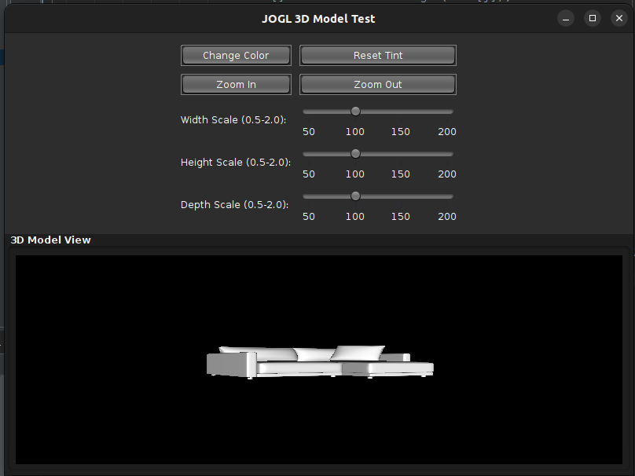

# JOGL3DModelTest Project Setup Guide

This guide walks you through creating a Java project using JOGL to render 3D models, with Ant as the build system.

---


## 1. Prerequisites

Ensure the following are installed:

- **Java JDK 8 or higher**
- **An IDE**: NetBeans, Eclipse, or IntelliJ
- **Apache Ant**
- **JOGL 2.3.2 Libraries**:  
  - `gluegen-rt.jar`  
  - `gluegen-rt-natives-<platform>.jar`  
  - `jogl-all.jar`  
  - `jogl-all-natives-<platform>.jar`

---

## 2. Project Directory Structure

Create the following directory layout:

```bash
mkdir JOGL3DModelTest
cd JOGL3DModelTest
mkdir -p src/com/rashsvr resources/com/rashsvr/model/obj/sofa/default_texture lib test
```

---

## 3. Add JOGL Libraries

Copy the JOGL JAR files into the `lib/` directory. You may rename them for clarity, e.g.:

```
lib/
├── gluegen-rt.jar
├── gluegen-rt-natives-<platform>.jar
├── jogl-all.jar
└── jogl-all-natives-<platform>.jar
```

---

## 4. Add 3D Model Assets

Place the following model and texture files into:

```
resources/com/rashsvr/model/obj/sofa/
```

Files:
- `sofa.obj`
- `sofa.mtl`
- `2 seat sofa_S01 M02_BaseColor.png`
- `2 seat sofa_S01 M02_Normal.png`

✅ Ensure:
- `sofa.obj` references `sofa.mtl`
- `sofa.mtl` references the correct texture filenames

---

## 5. Create Main Java Class

Create a file:  
`src/com/rashsvr/JOGL3DModelTest.java`

This class should:
- Use the package `com.rashsvr`
- Extend `JFrame` and implement `GLEventListener`
- Handle:
  - 3D model loading
  - Texture application
  - Model rotation
  - Zoom and scaling
  - Color tinting
  - A dark-themed UI

---

## 6. Ant Build File

Add `build.xml` to the root directory. It should:

- Compile Java files from `src/` to `build/classes/`
- Copy `resources/` to the build output
- Define targets to run `com.rashsvr.JOGL3DModelTest`

---

## 7. Import into Your IDE

### NetBeans
- Open the project folder
- Add `src/` as source
- Add JARs from `lib/` as libraries

### IntelliJ IDEA
- Open the project folder
- Add JARs as libraries
- Import and configure `build.xml` for Ant

### Eclipse
- Import the project as Java or Ant project
- Add JARs to the build path
- Use Ant view to build/run

---

## 8. Build & Run

Use Ant from the command line:

```bash
ant build
ant run
```

Or run directly from your IDE.

---

## 9. Test the Application

Verify that the following features work as expected:

- 3D model renders correctly
- Textures are applied
- Rotation and zoom controls
- Scaling and color tinting
- Dark UI theme

---

## 10. Troubleshooting

- Check file paths and references
- Ensure platform-specific native JARs match your OS
- If needed, enhance the project with additional textures or GLSL shaders

---
